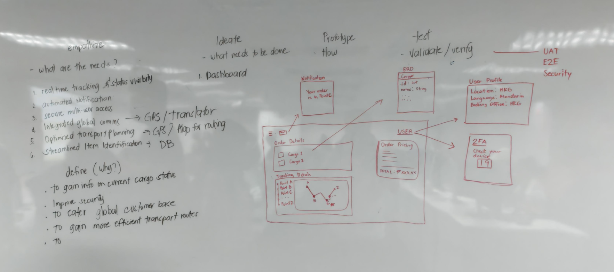

# Activity [1]: [Design Thinking]

## Objective
Simulate the Design Thinking based on the provided business Requirement

## Approach / Solution
Explain your solution or steps taken to solve the exercise.
- Step 1: [Brain Storming, identifying prblem and providing solutions]

## Key Code Snippets
<!-- Include only the important parts of your code. -->

## Documentation

*Activity 1: Created a rough sketch of the design*
