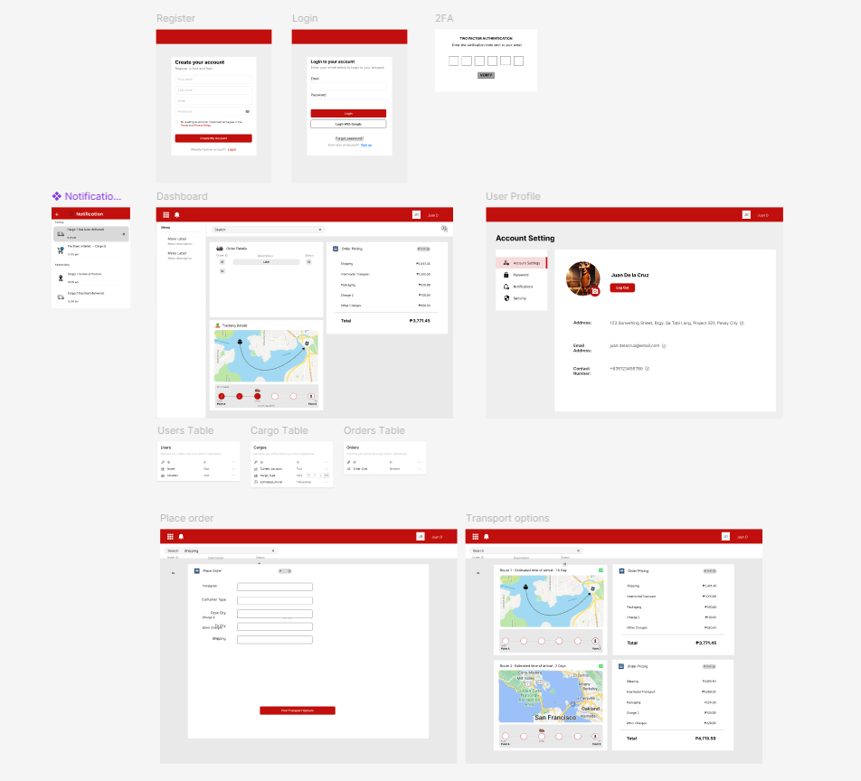

# Activity [1-2]: [Design Thinking]

## Objective
Simulate the Design Thinking based on the provided business Requirement

## Approach / Solution
Explain your solution or steps taken to solve the exercise.
- Step 1: [Creation of User stories for Sprint Planning using Jira]
- Step 2: [Creating prototype of the solution using Figma]

## Key Code Snippets
<!-- Include only the important parts of your code. -->

## Documentation

*Activity 1: Creation of User Stories using Jira Board*

*Activity 2: High Fidelity Prototyping using Figma*