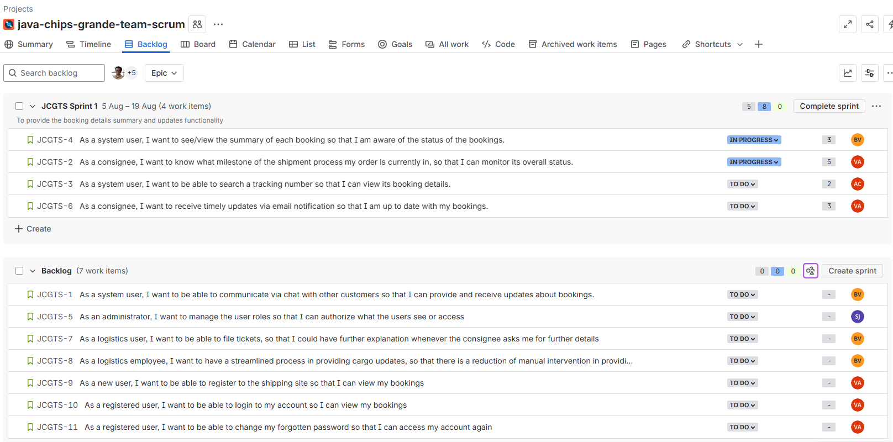

# Day 2

## Design Thinking Activity:
### [Figma](https://www.figma.com/design/PBG7IJA9oZ99tRTwp0mB2Z/ITA-10-Design-Thinking-Activity--CAMERA-?node-id=0-1&p=f)

## Sprint Planning Activity [Jira] (ITA-10 CAMERA):
### Sticky Notes

### [Jira](https://annadesembrana.atlassian.net/jira/software/projects/I1C/boards/35/backlog?atlOrigin=eyJpIjoiN2UxMjA5MDYwNjUwNDRkZGE3NjdlOTg4MDViNTU3YzgiLCJwIjoiaiJ9)
